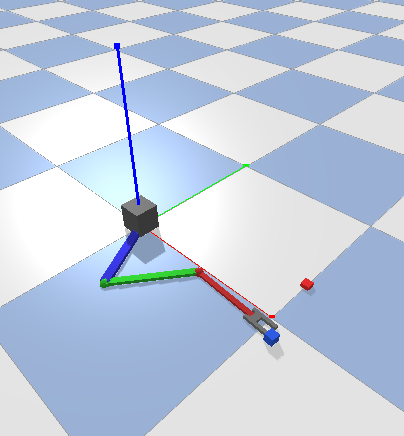
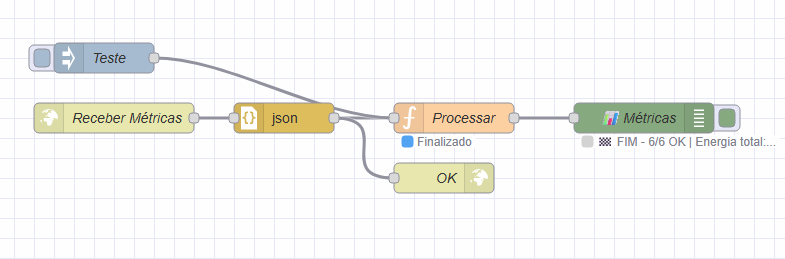
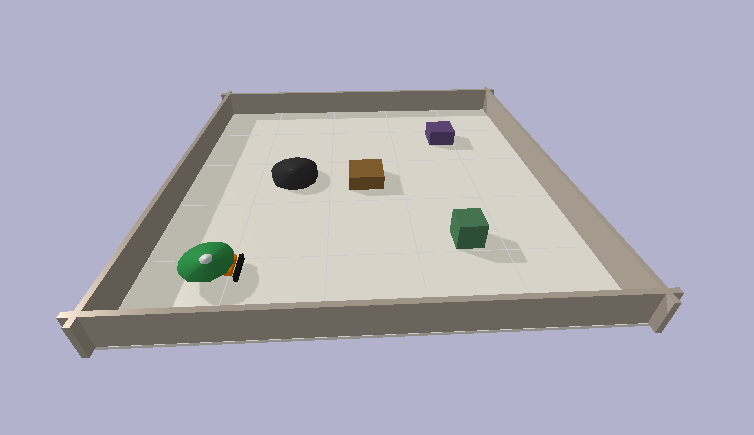
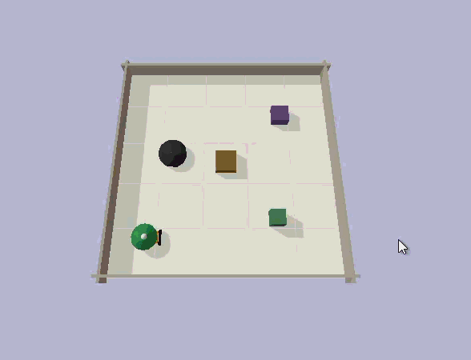
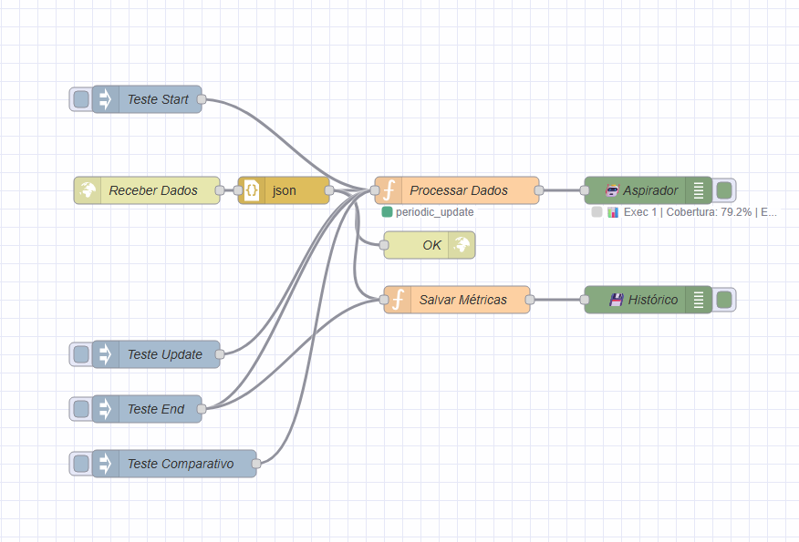

# 🤖 Simulação de Sistemas Robóticos com PyBullet e Supervisão Node-RED

Este repositório contém dois projetos de simulação robótica desenvolvidos como trabalho acadêmico de Robótica. Ambos os sistemas utilizam **PyBullet** para simulação física e **Node-RED** para supervisão em tempo real.

---

## 📋 Índice

1. [Visão Geral](#visão-geral)
2. [Projeto 1: Manipulador Planar 2/3 DOF](#projeto-1-manipulador-planar-23-dof)
3. [Projeto 2: Robô Aspirador Inteligente](#projeto-2-robô-aspirador-inteligente)
4. [Instalação](#instalação)
5. [Configuração do Node-RED](#configuração-do-node-red)
6. [Requisitos Atendidos](#requisitos-atendidos)

---

## 🎯 Visão Geral

| Projeto | Descrição | Tipo de Robô | Controle |
|---------|-----------|--------------|----------|
| **Manipulador Planar** | Braço robótico articulado com 2/3 juntas | Manipulador | PID por junta |
| **Robô Aspirador** | Robô móvel diferencial com mapeamento | Móvel | Navegação autônoma |

Ambos os projetos implementam:
- ✅ Simulação física realista com PyBullet
- ✅ Sensores simulados (encoders, ultrassônico, torque)
- ✅ Controle em malha fechada
- ✅ Supervisão via Node-RED com dashboards
- ✅ Métricas de desempenho e logs

---

## 🦾 Projeto 1: Manipulador Planar 2/3 DOF

<p align="center">
  
  <br>
  <em>Simulação do braço robótico planar 3-DOF no PyBullet</em>
</p>

### Demonstração

<p align="center">
  
  <br>
  <em>Ciclo de pegar e soltar objetos com controle PID</em>
</p>

### Descrição

Simulação de um braço robótico articulado em plano (2 ou 3 juntas rotacionais) controlado por loops PID individuais para que as juntas atinjam ângulos de referência.

### Funcionalidades

| Funcionalidade | Descrição |
|----------------|-----------|
| **Cinemática Direta** | Cálculo da posição do efetuador a partir dos ângulos das juntas |
| **Cinemática Inversa** | Resolução de ângulos para atingir posição desejada |
| **Controle PID** | Controle em malha fechada individual por junta |
| **Detecção de Alvos** | Identificação automática de objetos no ambiente |
| **Desvio de Obstáculos** | Ajuste automático de trajetória para evitar colisões |
| **Grasping** | Simulação de pegada e transporte de objetos |
| **Perturbações** | Reação a mudanças de massa no efetuador |

### Arquitetura

```
PyBullet (Simulação) → Controle PID → Node-RED (Supervisão)
     │                       │              │
     ├─ Encoder (ângulo)     ├─ Erro → Torque   ├─ Erro médio
     ├─ Sensor de torque     └─ PID por junta   ├─ Overshoot
     └─ Motores (juntas)                        └─ Energia/Status
```

### Estrutura de Arquivos

```
manipulador-planar/
├── main.py                 # Loop principal da simulação
├── node_red_client.py      # Cliente HTTP para Node-RED
├── flow.json               # Flow do Node-RED
├── models/
│   ├── planar_arm_2dof.urdf  # Modelo URDF 2 DOF
│   └── planar_arm_3dof.urdf  # Modelo URDF 3 DOF
└── src/
    ├── kinematics.py       # Cinemática direta e inversa
    ├── kinetics.py         # Dinâmica do manipulador
    ├── arm.py              # Classe do braço com PID
    ├── control.py          # Controlador de movimento/grasping
    └── simulation.py       # Configuração do ambiente PyBullet
```

### Como Executar

```bash
cd manipulador-planar
python main.py --dof 3 --cycles 6
```

**Argumentos:**
| Argumento | Descrição | Padrão |
|-----------|-----------|--------|
| `--dof` | Graus de liberdade (2 ou 3) | 3 |
| `--cycles` | Ciclos de pegar/soltar | 6 |
| `--nogui` | Executar sem interface gráfica | False |

### Métricas Supervisionadas

| Métrica | Descrição | Unidade |
|---------|-----------|--------|
| Erro médio | Diferença média entre ângulo alvo e atual | graus |
| Overshoot máximo | Maior erro registrado durante movimento | graus |
| Energia total | Trabalho realizado pelos motores | Joules |
| Tempo de estabilização | Tempo até erro < limiar | segundos |

### Flow Node-RED

<p align="center">
  
  <br>
  <em>Flow do Node-RED para supervisão do manipulador planar</em>
</p>

---

## 🧹 Projeto 2: Robô Aspirador Inteligente

<p align="center">
  
  <br>
  <em>Robô aspirador diferencial com sensores ultrassônicos</em>
</p>

### Demonstração

<p align="center">
  
  <br>
  <em>Navegação autônoma com mapeamento e aprendizado de rotas</em>
</p>

### Descrição

Simulação de um robô móvel diferencial com sensores de distância e lógica de varredura do ambiente. O robô explora um ambiente desconhecido, evita colisões, mapeia obstáculos e **aprende trajetórias mais eficientes** nas execuções seguintes.

### Funcionalidades

| Funcionalidade | Descrição |
|----------------|-----------|
| **Exploração Autônoma** | Navegação exploratória com algoritmo de varredura (boustrophedon) |
| **Evasão de Obstáculos** | Detecção e desvio usando 5 sensores ultrassônicos |
| **Mapeamento de Ocupação** | Matriz 2D construída a partir das leituras de sensores |
| **Registro de Trajetória** | Log de posição (x, y, heading) e tempo por célula |
| **Aprendizado por Repetição** | Reutilização do mapa anterior para otimizar rotas |
| **Métricas de Eficiência** | Área/energia, tempo, colisões |

### Arquitetura

```
PyBullet (Simulação) → Mapeamento → Node-RED (Supervisão)
     │                     │              │
     ├─ 5 sensores US      ├─ Mapa 2D       ├─ Trajetória
     ├─ Pose (x,y,θ)       ├─ Log trajetória ├─ Cobertura %
     └─ Rodas diferenciais └─ Aprendizado    └─ Eficiência
```

**Estados:** `SWEEPING` → `TURNING_END` → `AVOIDING` → `REVERSING` → `SEEKING` → `FINISHED`

### Comportamento de Aprendizado

| Execução | Comportamento | Resultado Esperado |
|----------|---------------|-------------------|
| **1ª** | Navegação exploratória (varredura sistemática) | Rota menos eficiente, mais colisões |
| **2ª** | Usa mapa salvo, evita áreas já limpas | Redução de tempo e energia |
| **3ª** | Otimização refinada, foco em áreas não visitadas | Máxima eficiência |

### Estrutura de Arquivos

```
robo-aspirador/
├── main.py                   # Loop principal com múltiplas execuções
├── node_red_flow.json        # Flow do Node-RED
├── models/
│   └── vacuum_robot.urdf     # Modelo URDF do robô
├── saved_maps/               # Mapas salvos entre execuções
│   ├── map_execution_1.json
│   ├── map_execution_2.json
│   └── all_metrics.json
└── src/
    ├── robot.py              # Classe VacuumRobot (sensores, atuadores)
    ├── environment.py        # Ambiente PyBullet (paredes, obstáculos)
    ├── mapping.py            # Mapa de ocupação 2D
    ├── controller.py         # Navegação e aprendizado
    └── node_red_client.py    # Cliente HTTP para Node-RED
```

### Como Executar

```bash
cd robo-aspirador
python main.py --executions 3 --time 90
```

**Argumentos:**
| Argumento | Descrição | Padrão |
|-----------|-----------|--------|
| `-e, --executions` | Número de execuções | 3 |
| `-t, --time` | Tempo máximo por execução (s) | 90 |
| `--no-gui` | Sem interface gráfica | False |
| `--no-nodred` | Sem envio ao Node-RED | False |
| `--clean` | Limpar mapas salvos | False |

### Métricas de Avaliação

| Métrica | Descrição | Objetivo |
|---------|-----------|----------|
| **Cobertura (%)** | Percentual de área limpa | Maximizar |
| **Tempo total** | Duração da execução | Minimizar |
| **Energia (J)** | Consumo estimado (∫ torque × dt) | Minimizar |
| **Eficiência** | Área coberta / energia | Maximizar |
| **Colisões** | Número de impactos | Minimizar |
| **Área/Energia (m²/J)** | Produtividade | Maximizar |

### Flow Node-RED

<p align="center">
  
  <br>
  <em>Flow do Node-RED para supervisão do robô aspirador</em>
</p>

---

## ✅ Requisitos Atendidos

### Projeto 1: Manipulador Planar

| Requisito | Status |
|-----------|--------|
| Manipulador planar 2/3 DOF | ✅ |
| Controle PID por junta | ✅ |
| Cinemática direta/inversa | ✅ |
| Detecção automática de alvo | ✅ |
| Desvio de obstáculos | ✅ |
| Pegar e carregar objetos | ✅ |
| Reação a perturbações (massa variável) | ✅ |
| Sensores simulados (encoder, torque) | ✅ |
| Métricas de log enviadas ao Node-RED | ✅ |

### Projeto 2: Robô Aspirador

| Requisito | Status |
|-----------|--------|
| Robô móvel diferencial | ✅ |
| Sensores ultrassônicos (3-5) | ✅ |
| Exploração de ambiente desconhecido | ✅ |
| Evasão de colisões | ✅ |
| Mapeamento de ocupação 2D | ✅ |
| Registro de trajetória | ✅ |
| Aprendizado por repetição | ✅ |
| Otimização de rotas | ✅ |
| Supervisório Node-RED | ✅ |
| Dashboards (trajetória, eficiência) | ✅ |
| Comparativo entre execuções | ✅ |

---

## 📊 Conceitos Aplicados

| Área | Manipulador | Aspirador |
|------|-------------|-----------|
| **Cinemática** | Direta/Inversa | Odometria diferencial |
| **Controle** | PID por junta | Navegação reativa |
| **Sensoriamento** | Encoder, torque | Ultrassônico (5x) |
| **Planejamento** | Trajetória articular | Varredura + busca |
| **Mapeamento** | - | Ocupação 2D (SLAM simples) |
| **Aprendizado** | - | Reutilização de mapa |
| **Supervisão** | Node-RED | Node-RED |

---

## 👥 Autor

- **Luca Aguiar** - [@devvluca](https://github.com/devvluca)

---

## 📄 Licença

Este projeto é desenvolvido para fins acadêmicos.
